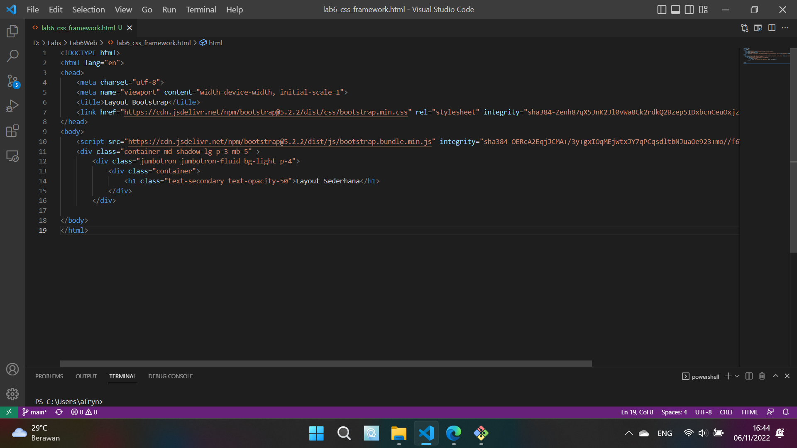
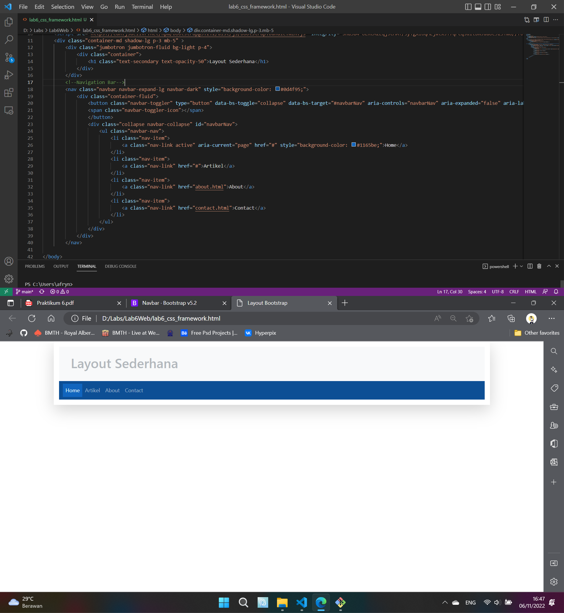
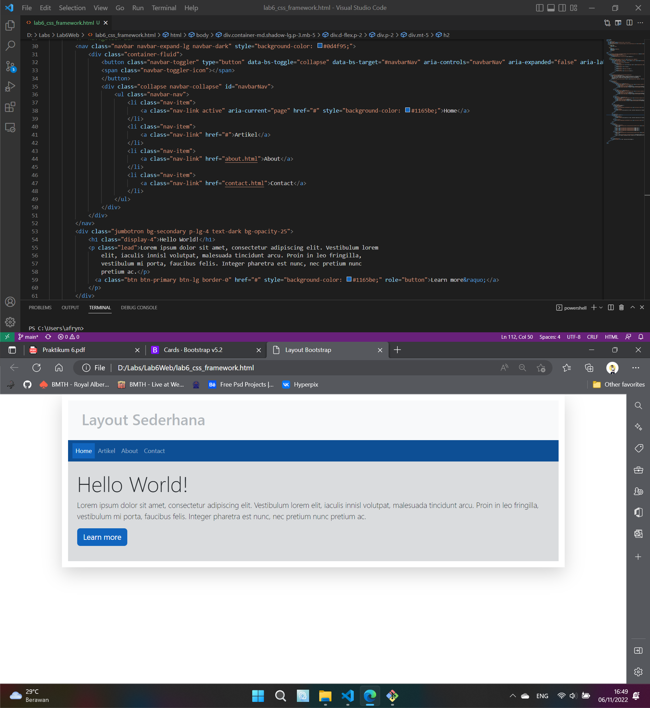
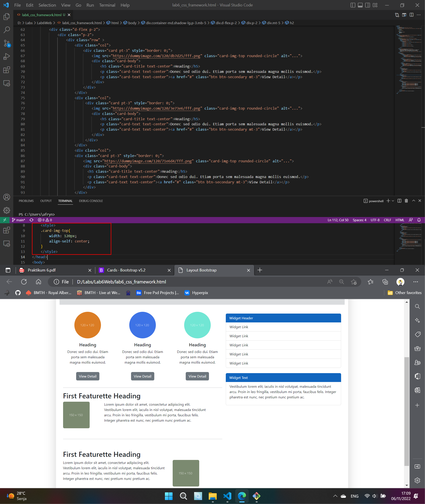
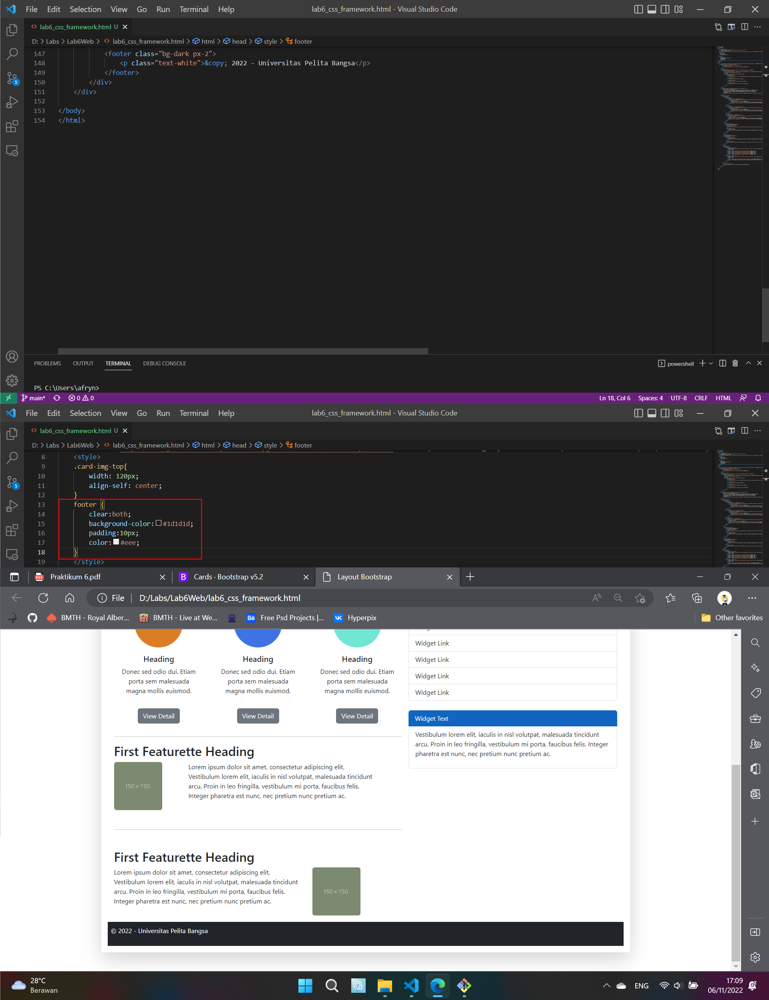

# Lab6Web
## Ananda Fachri Reynaldi
## 312110248
## TI.21.B1

<b>Membuat Layout Web Dengan Twitter Bootstrap</b>

1. Membuat Dokumen Baru Dengan Struktur Dasar HTML dan Karena 
Menggunakan Bootstrap Online Maka Tambahkan Link CDN Bootstrap<br>
Pada Bagian `<head>` Tambahkan CSS Bootstrap 
```
<link href="https://cdn.jsdelivr.net/npm/bootstrap@5.2.2/dist/css/bootstrap.min.css" rel="stylesheet" integrity="sha384-Zenh87qX5JnK2Jl0vWa8Ck2rdkQ2Bzep5IDxbcnCeuOxjzrPF/et3URy9Bv1WTRi" crossorigin="anonymous">
``` 
dan Pada Bagian `<body>` Load Javascript
```
<script src="https://cdn.jsdelivr.net/npm/bootstrap@5.2.2/dist/js/bootstrap.bundle.min.js" integrity="sha384-OERcA2EqjJCMA+/3y+gxIOqMEjwtxJY7qPCqsdltbNJuaOe923+mo//f6V8Qbsw3" crossorigin="anonymous"></script>
```
Lalu Membuat Layout Dengan Menggunakan `Container` Berikan Judul "Layout Sederhana"

2. Membuat Navbar<br>
Untuk Membedakan Halaman Mana Yang Aktif Tambahkan 
```
style="background-color: #1165be;"
```

3. Menambahkan Hero Panel Dengan `Jumbotron`

4. Menambahkan `Container` Cards 1<br>
Agar Gambar Berada Di Tengah Tambahkan `<style>` Pada `<head>`
```
.card-img-top{
        width: 120px;
        align-self: center;
    }
```
Lalu Membuat Cards 2 dan Widget Link

5. Membuat Footer<br>
Agar Area Lebih Besar Tambahkan `<style>`
```
footer {
        clear:both;
        background-color:#1d1d1d; 
        padding:10px;
        color:#eee;
    }
```



